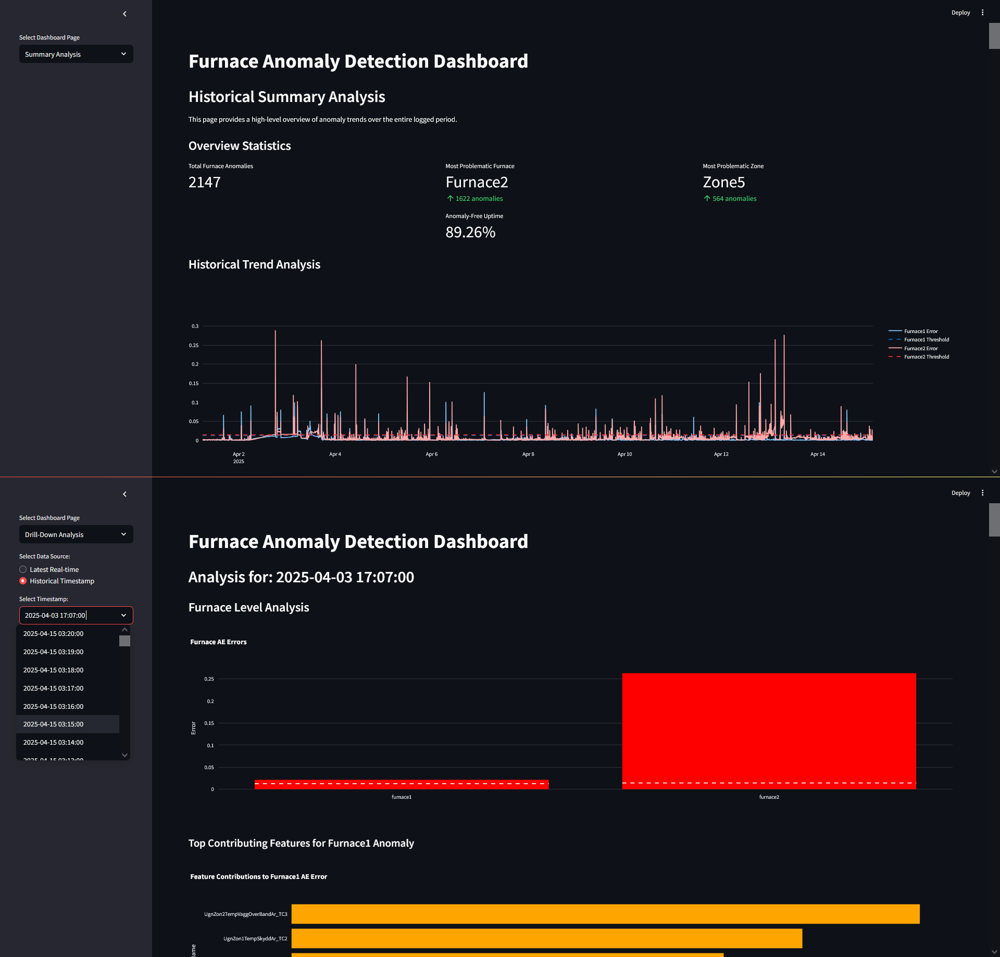
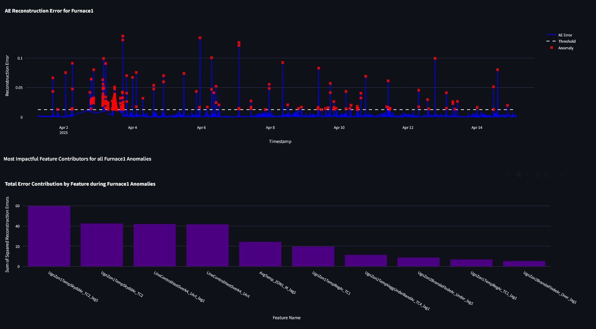
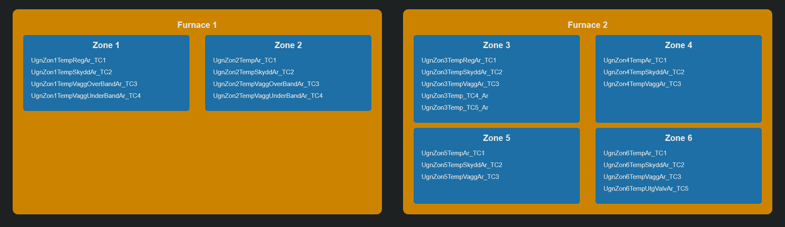
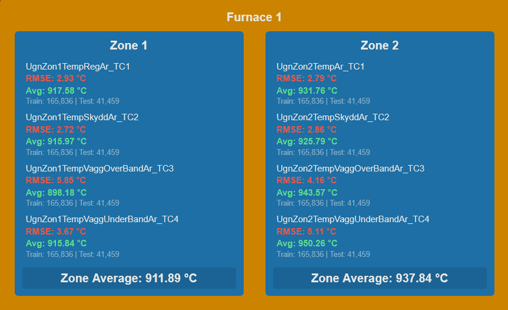
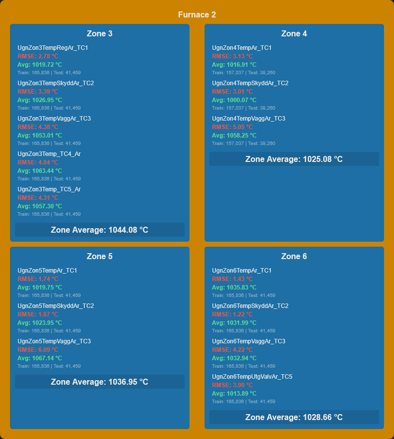

# Level-Based Unsupervised Anomaly Detection for Industrial Furnaces

This repository contains the code and documentation for the Master's Thesis project titled: "Level-Based Unsupervised Anomaly Detection for Industrial Thermocouple Sensor Data in Stainless Steel Furnaces". The project was developed in collaboration with **Outokumpu**, the largest producer of stainless steel in Europe.

## 1. Project Overview

This project pioneers a novel, unsupervised anomaly detection system designed to monitor the health of industrial thermocouples in stainless steel furnaces. Traditional monitoring relies on static thresholds or requires labeled data, which is often unavailable in industrial settings. This system addresses that gap by learning the normal operational behavior of the furnaces from historical data and flagging any significant deviations.

The core idea is a **hierarchical, multi-level detection framework** that provides not only alerts but also actionable, diagnostic insights.

### Key Features:
- **Unsupervised Learning:** Operates without any pre-labeled anomaly data, making it ideal for real-world industrial applications.
- **Hierarchical Detection:** Drills down from a high-level furnace view to specific zones and individual thermocouples to pinpoint the root cause of anomalies.
- **Diagnostic Power:** Uses a combination of reconstruction-based (Autoencoders) and prediction-based (Ridge Regression) models to identify *if*, *where*, and *why* an anomaly is occurring.
- **Temporal Context:** Integrates lagged features (`t-1`) to give the models a "memory" of the recent past, significantly improving diagnostic accuracy.
- **Interactive Visualization:** A Streamlit dashboard provides real-time monitoring, feature contribution analysis for root-cause identification, and a historical summary of anomalies.

## 2. The Hierarchical Detection Logic

The system is designed for efficiency and interpretability. Instead of running all models at once, it uses a gated, top-down approach:

1.  **Level 1: Furnace-Level Anomaly Detection**
    - An **Autoencoder** model trained on all sensors for an entire furnace monitors its overall health.
    - If the reconstruction error exceeds a predefined threshold, it triggers a deeper investigation.

2.  **Level 2: Zone-Level Localization**
    - If a furnace is flagged, **zone-specific Autoencoders** are run for all zones within that furnace.
    - This localizes the problem to the specific zone(s) with high reconstruction error.

3.  **Level 3: Thermocouple-Level Diagnosis**
    - For the most anomalous zone, **Ridge Regression models**—one for each thermocouple—are used.
    - Each model predicts a thermocouple's temperature based on its neighbors and other process variables. A large difference between the predicted and actual values points to a faulty sensor.
    - The evaluation results for ridge regression:
  
      
      
      

## 3. Technology Stack

- **Backend & Modeling:** Python, Pandas, NumPy
- **Machine Learning:** TensorFlow/Keras (for Autoencoders), Scikit-learn (for Ridge Regression, Isolation Forest, and Preprocessing)
- **Dashboard:** Streamlit

## 4. Repository Structure

├── ModelCreations.ipynb # Jupyter Notebook for data prep, model training, and saving.

├── Benchmark.ipynb # Notebook for comparing Autoencoder vs. Isolation Forest performance.

├── Analyzer.py # Python script to process new data rows and apply trained models.

├── Dashboard.py # The main Streamlit application for visualization.

├── Master Degree Project 60 credits_Ebrahim_Golriz.pdf # The full PDF of the Master's Thesis.
